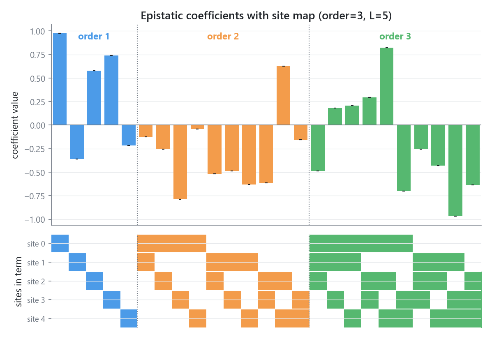

# Plotting epistatic coefficients

`epistasis.pyplot` is an optional matplotlib-backed subpackage. Install via:

=== "uv"

    ```bash
    uv add "epistasis-v2[plot]"
    ```

=== "pip"

    ```bash
    pip install "epistasis-v2[plot]"
    ```

Importing `epistasis.pyplot` without matplotlib installed raises a clear `ImportError`.

## `plot_coefs`

`plot_coefs` reproduces the signature figure from the original epistasis package: a
bar chart of fitted coefficients colored by interaction order, with a grid underneath
marking which sites participate in each term.

```python
import numpy as np
from epistasis.models.linear import EpistasisLinearRegression
from epistasis.pyplot import plot_coefs
from epistasis.simulate import simulate_random_linear_gpm

gpm, _, _ = simulate_random_linear_gpm(
    wildtype="AAAAA",
    mutations={i: ["A", "T"] for i in range(5)},
    order=3,
    rng=np.random.default_rng(0),
)
model = EpistasisLinearRegression(order=3).add_gpm(gpm).fit()

fig, (bar_axis, grid_axis) = plot_coefs(model)
fig.savefig("coefs.png", dpi=200, bbox_inches="tight")
```



Reading the figure:

- Each bar is one epistatic coefficient. Bars are colored by interaction order
  (order 1, order 2, ...). The intercept term is dropped.
- Vertical dotted lines separate the orders, and each block is labeled.
- The grid underneath has one row per site and one column per coefficient. A cell is
  filled (in that term's order color) when the site participates in the term. The
  order-1 block is the diagonal; higher orders show the combinatorial structure.

## Without a model

Pass coefficients directly with `sites=` and `values=`. `sites` is a sequence of
1-indexed site tuples; the intercept is `(0,)` and is dropped automatically.

```python
from epistasis.pyplot import plot_coefs

sites = [(1,), (2,), (3,), (1, 2), (1, 3), (2, 3)]
values = [0.5, -0.3, 0.8, 0.2, -0.1, 0.15]
fig, axes = plot_coefs(sites=sites, values=values)
```

## Significance shading and stars

When `sigmas > 0` and standard errors are available (e.g. from an OLS fit),
`plot_coefs` draws error bars, greys out terms that are not significant, and stacks
`*` markers per `star_cutoffs` threshold crossed. Significance uses Bonferroni-corrected
p-values by default (`significance="bon"`; use `"p"` for raw, or `None` to disable).

```python
fig, axes = plot_coefs(model, sigmas=1.0, significance="bon", significance_cutoff=0.05)
```

## Customizing

| Parameter | Default | Notes |
|---|---|---|
| `order_colors` | `DEFAULT_ORDER_COLORS` | Colors indexed by order; index 0 is the intercept / insignificant color |
| `xgrid` | `True` | Draw the site-participation grid panel |
| `height_ratio` | `3.0` | Bar-panel height relative to the grid panel |
| `figsize` | `(8.0, 5.0)` | Used only when `ax` is not supplied |
| `y_axis_name` | `"coefficient value"` | Bar-panel y-axis label |
| `ax` | `None` | Draw into existing axes: `[bar_axis, grid_axis]`, or `[bar_axis]` when `xgrid=False` |

The grid cell borders pick up the active matplotlib theme's `grid.color`, so the figure
adapts to light and dark styles automatically.

## Saving figures

`fig` is a plain matplotlib `Figure`:

```python
fig.savefig("coefs.png", dpi=200, bbox_inches="tight")
fig.savefig("coefs.svg")
```

See the [pyplot reference](../reference/pyplot.md) for the full signature.
