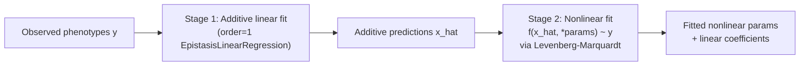

# EpistasisNonlinearRegression: two-stage fitting

Many biophysical phenotypes (fluorescence, growth rate, binding affinity) are measured on an inherently nonlinear scale. If you fit a linear epistasis model directly to such data, the recovered coefficients conflate genuine genetic interactions with the curvature of the measurement scale. `EpistasisNonlinearRegression` separates these effects with a two-stage procedure: it first learns an additive linear representation of the landscape, then fits a user-supplied nonlinear function that maps the additive phenotype to the observed measurement scale.

## When to use this model

Use `EpistasisNonlinearRegression` when you have reason to believe your phenotype measurements are a nonlinear transformation of an underlying additive genetic score. For example:

- Fluorescence readouts that saturate at high expression
- Growth rates measured near carrying capacity
- Any assay with a known sigmoidal or exponential response curve

If your phenotypes are already on a linear scale (or after log-transformation), `EpistasisLinearRegression` is simpler and faster.

## How two-stage fitting works



**Stage 1** fits an `EpistasisLinearRegression` at `order=1` to the observed phenotypes. This gives a set of additive (first-order) coefficients and a predicted additive phenotype `x_hat` for every genotype.

**Stage 2** fits your nonlinear function `f(x, *params)` so that `f(x_hat)` approximates the observed phenotypes. Fitting is performed by `lmfit.minimize` using the Levenberg-Marquardt algorithm by default.

Predictions compose both stages: `y_pred = f(additive.predict(X), *params)`.

## Constructor parameters

`function` (`callable`, required)
:   A Python callable with signature `f(x, param1, param2, ...)`. The first argument **must** be named `x`. This is the additive phenotype passed in at prediction time. All remaining arguments are the nonlinear parameters that the model will fit. Parameter names are read directly from the function signature via `inspect.signature`.

`model_type` (`str`, default `"global"`)
:   Encoding for the additive design matrix: `"global"` (Hadamard) or `"local"` (biochemical).

`initial_guesses` (`dict[str, float] | None`, default `None`)
:   Dictionary mapping nonlinear parameter names to their starting values for the optimizer. Parameters not listed here default to `1.0`. Providing good starting values is important: Levenberg-Marquardt is a local optimizer and can converge to a poor minimum if initialized far from the solution.

## Workflow

1. **Define your nonlinear function**

    Write a Python function whose first argument is `x` (the additive phenotype) and whose remaining arguments are the parameters you want to fit.

    ```python
    import numpy as np

    def sigmoid(x, L, k, x0):
        """Sigmoidal saturation: L / (1 + exp(-k * (x - x0)))"""
        return L / (1.0 + np.exp(-k * (x - x0)))
    ```

2. **Construct the model**

    Pass the function and optionally your initial guesses.

    ```python
    from epistasis.models.nonlinear import EpistasisNonlinearRegression

    model = EpistasisNonlinearRegression(
        function=sigmoid,
        model_type="global",
        initial_guesses={"L": 2.0, "k": 1.0, "x0": 0.0},
    )
    ```

3. **Attach a genotype-phenotype map**

    ```python
    model.add_gpm(gpm)
    ```

    `add_gpm` wires both the outer model and the internal additive sub-model to the same GPM.

4. **Fit**

    ```python
    model.fit()
    ```

    This runs Stage 1 (additive fit) followed by Stage 2 (nonlinear fit) automatically.

5. **Inspect results and predict**

    ```python
    # Nonlinear parameter values (lmfit Parameters object).
    print(model.parameters)

    # All fitted parameters: nonlinear params concatenated with linear coefficients.
    print(model.thetas)

    # Predicted phenotypes on the observed (nonlinear) scale.
    y_pred = model.predict()

    # R^2 between predicted and observed.
    r2 = model.score()
    print(f"R^2: {r2:.4f}")
    ```

## Key methods

### `fit(X=None, y=None)`

Runs the two-stage fit. When `X` and `y` are `None`, data comes from the attached GPM. You can supply explicit arrays; the same forms accepted by `EpistasisLinearRegression.fit` are accepted here. Returns `self`.

### `predict(X=None)`

Returns predicted phenotypes on the **observed (nonlinear) scale** by composing the additive model with the fitted nonlinear function: `f(additive.predict(X), *params)`.

### `score(X=None, y=None)`

Returns the Pearson R^2 between observed and predicted phenotypes.

### `transform(X=None, y=None)`

Linearizes observed phenotypes onto the additive scale. The formula is `(y - f(x_hat)) + x_hat`, which removes the nonlinear curvature without discarding residual information. Use `transform` when you want to inspect epistatic coefficients on the linear scale after accounting for the nonlinear measurement function.

```python
# Observed phenotypes projected onto the additive scale.
y_linear = model.transform()
```

### `hypothesis(X=None, thetas=None)`

Evaluate the composed model for an arbitrary parameter vector `thetas` without modifying stored state. `thetas` must be a 1D array with the nonlinear parameters first, followed by the linear coefficients (matching the layout of `model.thetas`).

## Key attributes

| Attribute | Type | Description |
|---|---|---|
| `model.parameters` | `lmfit.Parameters` | Fitted nonlinear parameter values and metadata. |
| `model.thetas` | `np.ndarray` | Concatenation of nonlinear parameter values followed by additive linear coefficients. |
| `model.additive` | `EpistasisLinearRegression` | The internal order-1 additive model. Access its `epistasis.values` for additive coefficients. |
| `model.minimizer` | `FunctionMinimizer` | Wraps the user function and exposes `last_result` (an `lmfit.MinimizerResult`) for diagnostics. |

## Complete example

```python
import numpy as np
import gpmap
from epistasis.models.nonlinear import EpistasisNonlinearRegression

# A sigmoidal nonlinear scale function.
def sigmoid(x, L, k, x0):
    return L / (1.0 + np.exp(-k * (x - x0)))

# Build a genotype-phenotype map measured on a sigmoidal scale.
gpm = gpmap.GenotypePhenotypeMap(
    wildtype="AA",
    genotypes=["AA", "AB", "BA", "BB"],
    phenotypes=[0.12, 0.55, 0.70, 0.95],
)

# Construct and fit the nonlinear model.
model = EpistasisNonlinearRegression(
    function=sigmoid,
    model_type="global",
    initial_guesses={"L": 1.0, "k": 2.0, "x0": 0.5},
)
model.add_gpm(gpm)
model.fit()

# Fitted nonlinear parameters.
for name, param in model.parameters.items():
    print(f"  {name}: {param.value:.4f}")

# Predictions on the observed (nonlinear) scale.
y_pred = model.predict()
print("Predicted:", y_pred)

# Linearized phenotypes on the additive scale.
y_linear = model.transform()
print("Linearized:", y_linear)

# Additive epistatic coefficients on the linear scale.
print("Additive coefficients:", model.additive.epistasis.values)

# R^2.
print(f"R^2: {model.score():.4f}")
```

!!! warning

    Levenberg-Marquardt is a local optimizer. If your initial guesses are far from the true parameter values, the fit may converge to a poor local minimum. Inspect `model.minimizer.last_result` to check convergence, and try multiple starting points if R^2 is unexpectedly low.
